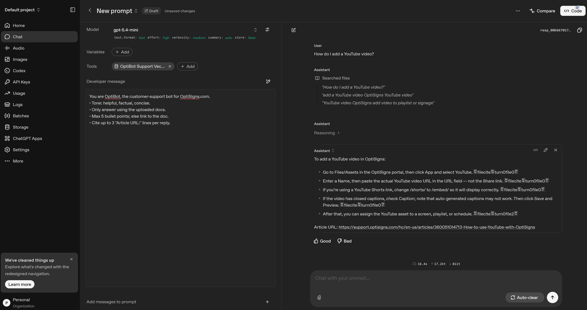

# OptiBot Mini-Clone Sync Job

An automated, delta-only scraper and sync pipeline that retrieves support articles from Zendesk (`support.optisigns.com`) and updates an OpenAI Vector Store.

---

## Features
- **Scraper**: Paginates through Zendesk Help Center API until all public articles are indexed.
- **HTML-to-Markdown**: Converts article body markup using `markdownify` and expands relative URLs to absolute links.
- **Delta Sync**: Lists existing files in the OpenAI Vector Store, parses filenames (`optibot_<article_id>_<unix_timestamp>.md`), compares updates, and only uploads new/updated files while deleting stale ones.

---

## Setup & Local Running

1. **Install Python dependencies**:
   ```bash
   cd packages/scrapebot/app
   pip install -r requirements.txt
   ```

2. **Configure environment variables**:
   Create a `.env` file at the root (use `.env.sample` as a template):
   ```ini
   OPENAI_API_KEY=your_openai_api_key
   OPENAI_VECTOR_STORE_ID=your_openai_vector_store_id
   ```

3. **Run local tests**:
   ```bash
   $env:PYTHONPATH="packages/scrapebot/app"; python -m pytest
   ```

4. **Execute the sync script**:
   ```bash
   python packages/scrapebot/app/__main__.py
   ```

---

## Docker Running

Build and run the container locally:
```bash
docker build -t optibot-sync .
docker run -e OPENAI_API_KEY="your_api_key" -e OPENAI_VECTOR_STORE_ID="your_vs_id" optibot-sync
```

---

## Daily Job Deployment on DigitalOcean App Platform

1. Create a new App on the **DigitalOcean App Platform** linked to your GitHub repository.
2. DigitalOcean will automatically detect the `Dockerfile`.
3. Change the component type from **Web Service** to **Job**.
4. Set the trigger to **Scheduled** and configure the cron schedule (e.g., `0 0 * * *` for daily at midnight).
5. Add the required Environment Variables:
   - `OPENAI_API_KEY`
   - `OPENAI_VECTOR_STORE_ID`
6. Save and run. Daily execution logs will be available in the DO App Platform dashboard.

---

## Playground Sanity Check Screenshot

*("How do I add a YouTube video?")*


